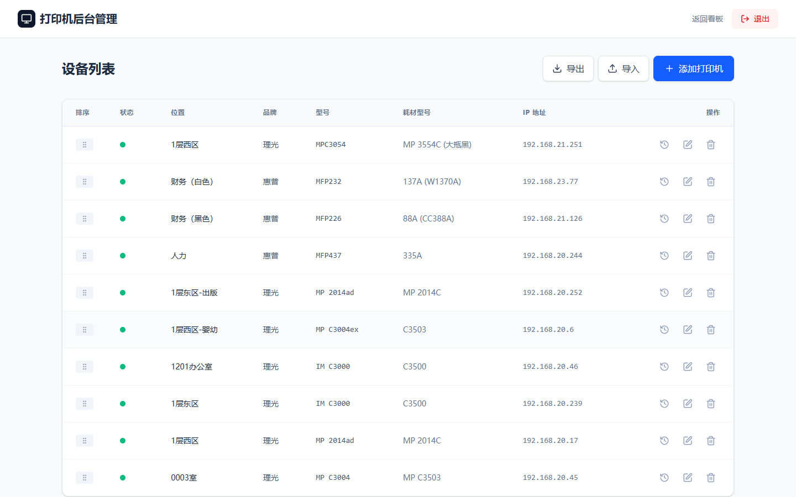

# Printer Monitor (打印机监控系统)

一个基于 Next.js 构建的现代化网络打印机状态监控系统。它可以监控碳粉/墨水余量（通过 SNMP），记录更换历史，并提供一个集中的管理看板。


## 功能特性

- **实时监控**：通过可视化进度条展示碳粉/墨水余量。
- **智能故障检测**：自动检测并显示“卡纸”、“缺纸”、“仓门打开”等具体故障状态。
- **更换记录管理**：
  - **自动记录**：当墨粉量显著增加时，系统会自动识别并记录。
  - **手动记录**：支持手动添加更换记录并备注详细信息（如“原装墨粉”）。
- **后台管理**：
  - **拖拽排序**：支持直观的拖拽方式调整设备显示顺序。
  - **设备管理**：添加、编辑、删除打印机，支持导入/导出 JSON 数据。
  - **系统配置**：自定义系统标题（自动同步浏览器标签页）、Logo、刷新频率及后台密码。
- **响应式设计**：完美适配桌面和移动端的现代化 UI。
- **数据同步**：前后台标题实时同步，状态自动轮询更新。

## 截图展示

| 主看板 | 后台管理 |
| :---: | :---: |
|  |  |

| 更换记录 | 移动端适配 |
| :---: | :---: |
|  | *响应式布局适配手机访问* |

## 支持设备

系统使用标准 SNMP (RFC 3805) 协议，并针对以下品牌进行了测试和优化：
- **理光 (Ricoh)** (如 MP C3004, IM C3000, MP 2014 等) - 包含针对非标准 MIB 的特殊处理。
- **惠普 (HP)** (LaserJet, MFP 系列)
- **通用 SNMP 打印机** (施乐 Xerox, 京瓷 Kyocera, 兄弟 Brother 等，只要支持标准 Printer MIB 均可使用)。

## 快速开始

### Docker 部署 (推荐)

1.  **运行 Docker 容器**：
    你可以直接运行构建好的镜像（请将 `/your/local/path/data` 替换为你本地用于存储数据库的路径）：

    ```bash
    docker run -d \
      -p 3000:3000 \
      -v /your/local/path/data:/app/data \
      -e TZ=Asia/Shanghai \
      --name printer-monitor \
      bbblq/printer-monitor:latest
    ```

    *注意：数据库文件 `printers.db` 将会自动创建在你挂载的目录中，重启并不会丢失数据。*

2.  **初始设置**：
    - 访问 `http://localhost:3000`。
    - 点击右上角的 **刷新状态** 按钮旁边的区域，或访问 `/admin` 进入后台。
    - 默认密码：`admin`。
    - 登录后请务必在 **系统配置** 中修改密码。

### 手动安装 (开发)

1.  **克隆项目**：
    ```bash
    git clone https://github.com/bbblq/printer-monitor.git
    cd printer-monitor
    ```

2.  **安装依赖**：
    ```bash
    npm install
    # 注意：better-sqlite3 需要构建工具（Windows 上需要 Visual Studio Build Tools，Linux 上需要 make/g++/python3）
    ```

3.  **运行开发服务器**：
    ```bash
    npm run dev
    ```

4.  **构建生产版本**：
    ```bash
    npm run build
    npm start
    ```

## 技术栈

- **框架**: Next.js 14 (App Router)
- **数据库**: SQLite (通过 `better-sqlite3`)
- **UI 组件**: Tailwind CSS, Lucide React
- **SNMP**: `net-snmp`

## 开源协议

MIT
