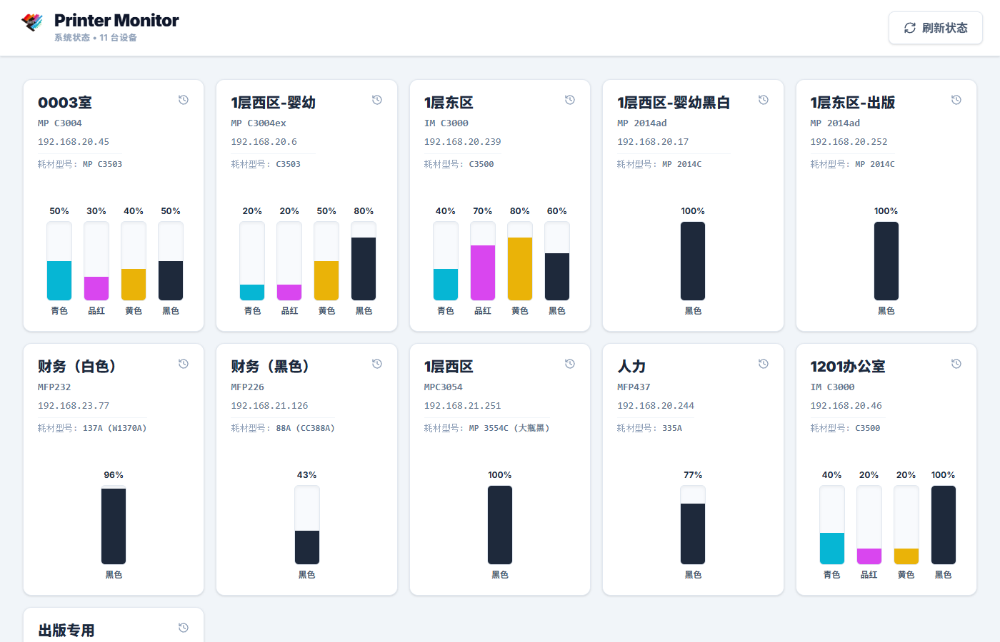
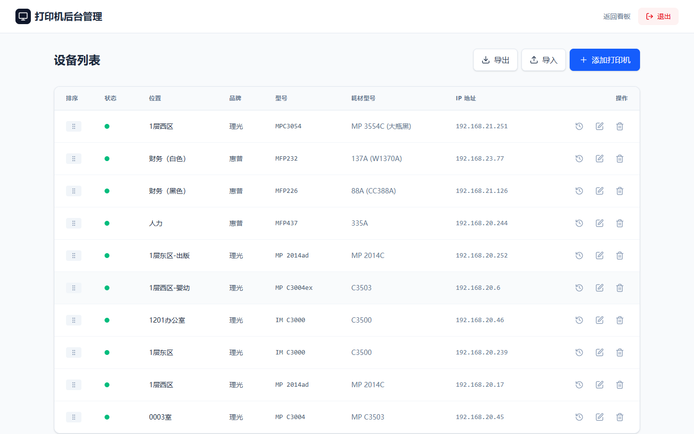

# Printer Monitor (打印机监控系统)

一个基于 Next.js 构建的现代化网络打印机状态监控系统。它可以监控碳粉/墨水余量（通过 SNMP），记录更换历史，并提供一个集中的管理看板。



## 功能特性

- **实时监控**：通过可视化进度条展示碳粉/墨水余量。
- **智能故障检测**：自动检测并显示"卡纸"、"缺纸"、"仓门打开"等具体故障状态。
- **更换记录管理**：
  - **自动记录**：当墨粉量显著增加时，系统会自动识别并记录。
  - **手动记录**：支持手动添加更换记录，可**自由选择换墨日期**并备注详细信息。
  - **双时间线**：区分「换墨日期」（实际更换时间）和「记录时间」（系统录入时间），便于补录历史记录。
  - **数据导出**：支持一键导出所有更换历史记录为 JSON 格式。
- **消息通知 (v1.3.0 重构)**：
  - **飞书专属**：深度集成飞书 Webhook 机器人，支持富文本交互式卡片。
  - **智能检测**：
    - **更换提醒**：自动记录更换前后的墨量变化（如 `5% ➔ 100%`）。
    - **耗材预警**：支持 **低墨 (<10%)** 和 **耗尽** 双重检测。
  - **每日日报**：可设定每天固定时间自动推送全网打印机状态概览。
- **后台管理**：
  - **拖拽排序**：支持直观的拖拽方式调整设备显示顺序。
  - **设备管理**：添加、编辑、删除打印机，支持导入/导出 JSON 数据。
  - **系统配置**：自定义系统标题（自动同步浏览器标签页）、Logo、刷新频率及后台密码。
  - **通知配置**：统一管理所有通知渠道和规则
- **响应式设计**：完美适配桌面和移动端的现代化 UI。
- **数据同步**：前后台标题实时同步，状态自动轮询更新。

## 截图展示

| 主看板 | 后台管理 |
| :---: | :---: |
|  |  |

| 更换记录 | 移动端适配 |
| :---: | :---: |
|  | *响应式布局适配手机访问* |

## 支持设备

系统使用标准 SNMP (RFC 3805) 协议，并针对以下品牌进行了测试和优化：
- **理光 (Ricoh)** (如 MP C3004, IM C3000, MP 2014 等) - 包含针对非标准 MIB 的特殊处理。
- **佳能 (Canon LBP Series)** (如 LBP6300n) - 针对无法报告精确余量的机型，优化为"正常/耗尽"的二元状态显示。
- **惠普 (HP)** (LaserJet, MFP 系列)
- **通用 SNMP 打印机** (施乐 Xerox, 京瓷 Kyocera, 兄弟 Brother 等，只要支持标准 Printer MIB 均可使用)。

## 快速开始

### Docker 部署 (推荐)

1.  **运行 Docker 容器**：
    你可以直接运行构建好的镜像（请将 `/your/local/path/data` 替换为你本地用于存储数据库的路径）：

    ```bash
    docker run -d \
      -p 3000:3000 \
      -v /your/local/path/data:/app/data \
      -e TZ=Asia/Shanghai \
      --name printer-monitor \
      bbblq/printer-monitor:latest
    ```

    *注意：数据库文件 `printers.db` 将会自动创建在你挂载的目录中，重启并不会丢失数据。*

2.  **初始设置**：
    - 访问 `http://localhost:3000`。
    - 点击右上角的 **刷新状态** 按钮旁边的区域，或访问 `/admin` 进入后台。
    - 默认密码：`admin`。
    - 登录后请务必在 **系统配置** 中修改密码。

### Docker Compose 部署 (CasaOS/Portainer 推荐)

1.  **创建目录与文件**：
    在你的服务器上创建一个新目录，并在其中创建 `docker-compose.yml` 文件，内容如下：

    ```yaml
    version: '3'
    services:
      printer-monitor:
        image: bbblq/printer-monitor:latest
        container_name: printer-monitor
        restart: unless-stopped
        ports:
          - "3000:3000"
        volumes:
          - ./data:/app/data
        environment:
          - TZ=Asia/Shanghai
    ```

2.  **启动服务**：
    ```bash
    docker-compose up -d
    ```

    *对于 CasaOS 用户，可以直接在"自定义安装"中导入此 Docker Compose配置，或者手动填入上述参数。*

### 手动安装 (开发)

1.  **克隆项目**：
    ```bash
    git clone https://github.com/bbblq/printer-monitor.git
    cd printer-monitor
    ```

2.  **安装依赖**：
    ```bash
    npm install
    # 注意：better-sqlite3 需要构建工具（Windows 上需要 Visual Studio Build Tools，Linux 上需要 make/g++/python3）
    ```

3.  **运行开发服务器**：
    ```bash
    npm run dev
    ```

4.  **构建生产版本**：
    ```bash
    npm run build
    npm start
    ```

## 更新日志

### v1.3.2 (2026-03-30)

#### 🐛 Bug 修复
- **飞书通知时区修复**：使用 `getTimezoneOffset` 硬编码计算北京时间，确保通知时间显示正确。
- **自动刷新修复**：`init.ts` 现已正确调用 `startAutoRefresh()`，定时自动刷新功能恢复正常。

#### ⚡ 体验优化
- **管理后台版本号**：系统配置区块右上角新增当前版本号显示，方便确认部署版本。
- **历史记录页面**：新增独立 `/history` 页面作为耗材更换仪表盘，支持年/月选择器（当前及历史月份）。

### v1.3.1 (2026-02-11)

#### ✨ 换墨日期优化
- **新增 `replaced_at` 字段**：区分「换墨日期」和「记录时间」，支持手动补录历史换墨记录。
  - **自动检测**：换墨日期自动等于检测时间。
  - **手动添加**：支持通过日期选择器指定实际换墨日期，记录时间保留为操作时间。
- **数据迁移兼容**：升级时自动将已有记录的 `replaced_at` 填充为 `recorded_at`，无需手动处理。
- **管理后台**：更换记录表格新增「换墨日期」列，手动添加弹窗新增日期选择器。
- **报表与导出**：日报和 JSON 导出均使用 `replaced_at` 作为换墨时间。

### v1.3.0 (2026-02-10)

#### 🚀 重构通知系统
- **移除** 旧版邮件/企业微信支持，精简代码库。
- **全新飞书集成**：
  - 采用 **Webhook 交互式卡片**，告别纯文本通知。
  - 新增 **每日日报** 功能，定时发送全网设备概览。
  - 优化 **更换检测算法**，准确记录耗材更换前后的百分比变化。
  - 优化 **二元状态打印机** (Canon LBP) 的耗尽报警逻辑。
- **后台优化**：
  - 新增 **飞书通知配置面板**，支持 Webhook 地址隐式显示和一键测试。
  - 修复了配置保存的数据类型问题。

### v1.2.0 (已废弃)
- *(此版本功能已被 v1.3.0 全面替代)*

### v1.1.1 (2026-02-10)

#### 🛠️ 工具优化
- 新增 **SNMP 调试工具** (`/admin/debug-snmp`)，可直接查看打印机原始 SNMP 数据
- 简化后台管理界面，移除复杂的规则配置 UI
- 特殊机型规则回归代码实现，便于维护和调试

### v1.1.0 (2026-02-09)

#### 🔒 安全改进
- 增强 Cookie 安全设置（sameSite, secure 标志）
- 优化认证中间件逻辑
- 添加后端 IP 地址格式验证

#### ⚡ 性能优化
- 实现并发刷新机制（每批 5 台打印机）
- SNMP 超时时间从 5 秒增加到 10 秒
- 重试次数从 2 次增加到 3 次

#### 🐛 Bug 修复
- 重构拖拽排序功能，移除全局变量 hack
- 统一错误消息语言为中文
- 优化代码类型安全

## 技术栈

- **框架**: Next.js 16 (App Router)
- **数据库**: SQLite (通过 `better-sqlite3`)
- **UI 组件**: Tailwind CSS, Lucide React
- **SNMP**: `net-snmp`

## 开源协议

MIT
